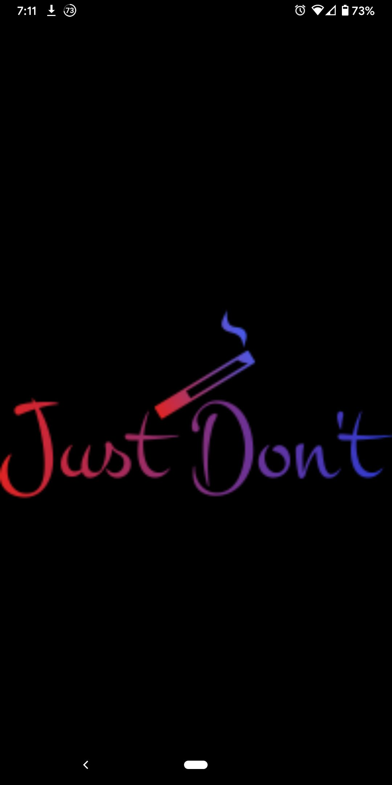
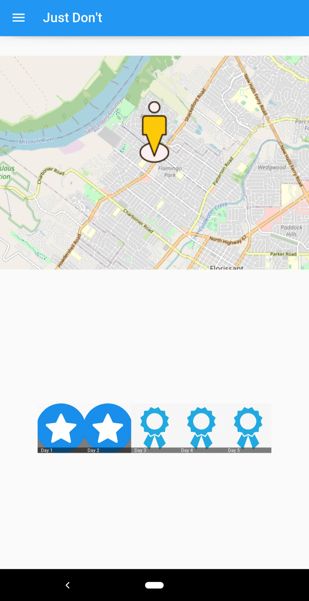
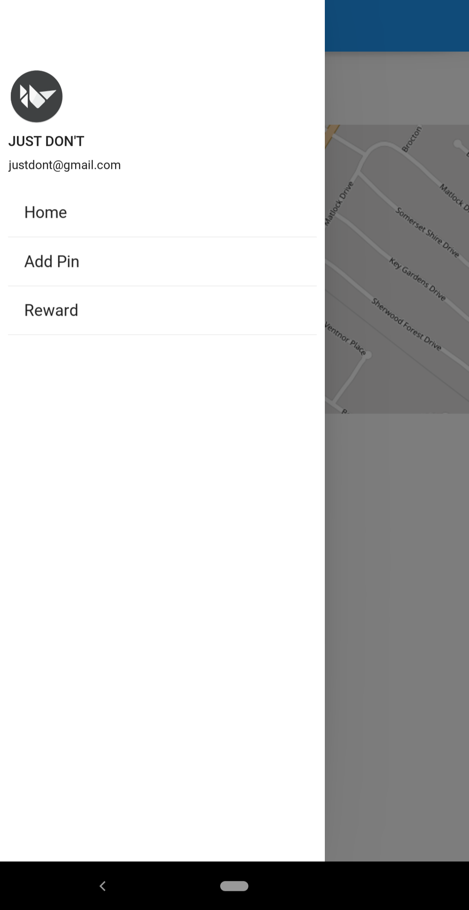
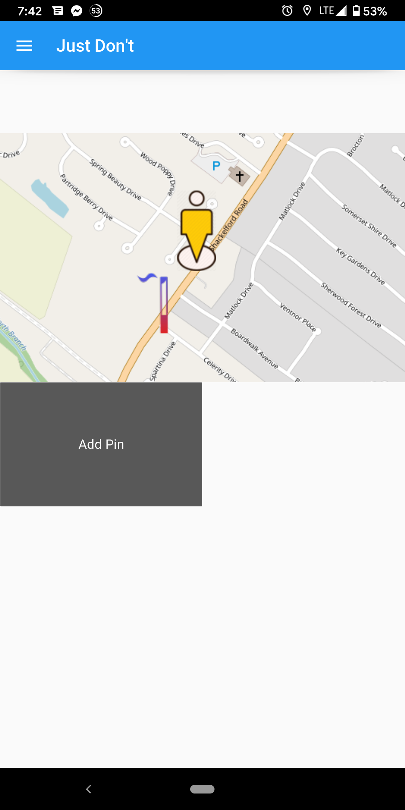
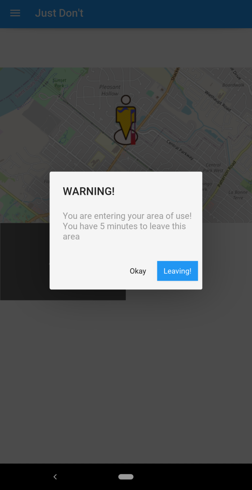

# Just Don't

Whether it was our own trials or a loved one's, each one of us have dealt with the affects of substance abuse.
Our app is designed to tackle one of the major factors of addiction; location.

Current approaches only track streaks of sobriety and reward users with achievements.
The problem with these approaches is that they rely on personal accountability.

To solve this issue our group designed an app that uses location data to reward users for staying out of their designated geofences, or "no-go" zones.

If the user does not enter any of their "no-go" zones in 5 days, they are rewarded with an Amazon gift card. More reward options would be added in future builds.
If the user enters their "no-go" zone they are prompted that they need to leave the zone within 5 minutes in order to keep their streak and recieve a reward.

## Authors

- [@BriannaWitherell](https://www.github.com/Quinticx)
- [@WyattMarks](https://www.github.com/WyattMarks)
- [@DanHigginbotham](https://www.github.com/Higgy710)
- [@JacobShemwell](https://www.github.com/jacobshemwell)
- [@JayaChitrakavi](https://www.github.com/jaya-c12)

  
## Screenshots
App view of the splash screen, which shows the app logo while the app loads.

App view of the home screen, which shows the users current location and current sobriety streak.

App view of the navigation screen, which allows the user to go to the homescreen, add a pin screen, or rewards screen.

App view of adding pins (cigarette marker) for user defined locations to avoid.

App view of the warning notification that appears when the user enters the geofence of an area they defined as a location to avoid.

## Lessons Learned
Throughout this project our team learned to effectively communicate, efficiently read documentation, and take a design from conception to finished product. Along the way, we faced many challenges. We had to switch Python frameworks halfway through day 1 from BeeWare to Kivy, we had building issues with most of our computers that took hours to debug, and we had to learn a brandnew framework and all of its quirks in less than 48 hours. Overall, our team worked wonderfully together, had a lot of fun, and learned more than we ever thought we could in 36 hours. 

  
  
