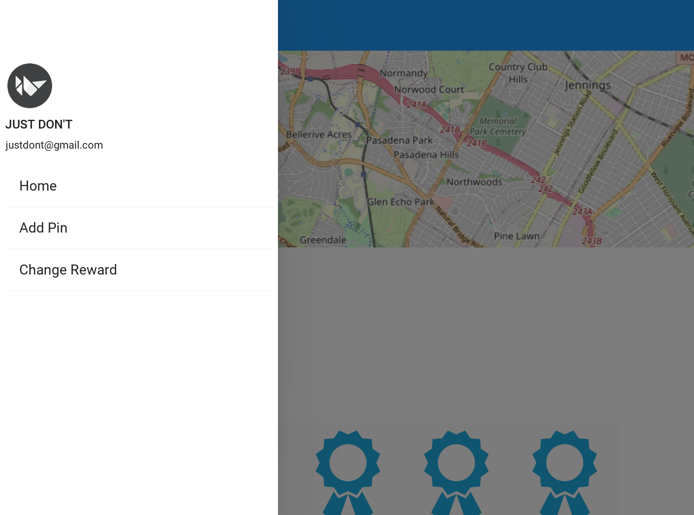

# Just Don't

Whether it was our own trials or a loved one's, each one of us have dealt with the affects of substance abuse.
Our app is designed to tackle one of the major factors of addiction; location.

Current approaches only track streaks of sobriety and reward users with achievements.
The problem with these approaches is that they rely on personal accountability.

To solve this issue our group designed an app that uses location data to reward users for staying out of their designated geofences.

## Authors

- [@BriannaWitherell](https://www.github.com/Quinticx)
- [@WyattMarks](https://www.github.com/WyattMarks)
- [@DanHigginbotham](https://www.github.com/Higgy710)
- [@JacobShemwell](https://www.github.com/jacobshemwell)
- [@JayaChitrakavi](https://www.github.com/jaya-c12)

  
## Demo

Insert gif or link to demo

  
## Screenshots
App view of the home screen, which shows the users current location and current sobriety streak.

App view of the navigation screen, which allows the user to go to the homescreen, add a pin screen, or choose rewards screen.

App view of adding pins for user defined locations to avoid.

  
  
